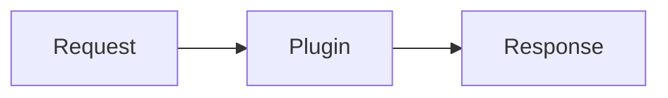

# Drupal Module Documentation (MkDocs)

## Overview

Drupal contrib modules publish documentation to GitLab Pages through the drupal.org
`gitlab_templates` pipeline. The docs live in a `docs/` folder, MkDocs (Material theme) builds them,
and the `pages` CI job deploys them to `https://project.pages.drupalcode.org/<data_name>`.
This skill writes that documentation, builds the `docs/` structure, and sets up or edits
`mkdocs.yml` and `.gitlab-ci.yml`.

The **data name** is the module's project machine name: the `.info.yml` prefix and the git repo
name (`git.drupalcode.org/project/<data_name>`).

## Writing Style

Documentation should read like a maintainer wrote it, not like an AI generated it. Apply these to
all prose in the docs (this matches the `drupal-project-description` skill).

- No em dashes and no en dashes. Use a comma, semicolon, colon, period, or parentheses, or rewrite.
  Plain hyphens are fine only in compound words.
- Active voice.
- Wry, plain, and direct. No flowery or superfluous language.
- No contrastive constructions such as "this isn't X, it's Y." State what the thing is.
- No marketing hype, subjective qualifiers, or value judgments. State facts a user can verify.
- No emojis in the prose.
- Terse and high in signal. Cut padding and throat-clearing intros.

## Workflow

1. **Read the module first.** Get the data name and human name from `<data_name>.info.yml`. Read the
   existing README, `docs/` (if any), config forms, routing, and services to learn what the module
   actually does before writing about it.

2. **Put all docs under `docs/`.** Entry point is `docs/index.md`. Never place doc pages elsewhere.

3. **Set up or edit `mkdocs.yml`** at the repo root. Adapt the template in `mkdocs.yml` in this
   skill folder. Set `site_name`, set `site_url` to
   `https://project.pages.drupalcode.org/<data_name>`, and keep `theme: name: material`. Build the
   `nav` from the structure below. The template ships the `markdown_extensions` and `plugins`
   config the drupal.org `ai` project uses (see "MkDocs plugins and extensions"), including the
   **mermaid** fence for diagrams. Reach for mermaid whenever a flow, architecture, plugin
   relationship, or state machine is clearer as a diagram than as prose.

4. **Handle `.gitlab-ci.yml`** (see the section below).

5. **Write the docs structure** (see Documentation Structure).

6. **Point the README at the docs.** Append a short section to the **end** of the module's
   `README.md` telling readers the full documentation lives under `docs/` and is published on
   GitLab Pages. Keep the rest of the README intact.
   ```markdown

   ## Documentation

   Full documentation is under [`docs/`](docs/) and published at
   https://project.pages.drupalcode.org/<data_name>.
   ```

7. **Screenshots (optional).** Ask the user first: to capture screenshots, they should install the
   `vercel/agent-browser` skill and tell you where their Drupal site is reachable (the base URL and
   any login). If they already have Puppeteer or another browser tool, use that instead. Skip
   screenshots silently if none is available; do not fabricate image paths.

8. **After the first push**, tell the user to open
   `https://git.drupalcode.org/project/<data_name>/pages` and turn off the unique ID (the "User
   unique domain" toggle under Deploy > Pages > Domains & settings). With it off the URL is the
   clean `https://project.pages.drupalcode.org/<data_name>`, which is what `site_url` should match.

## .gitlab-ci.yml

**If the file is missing completely**, add the standard drupal.org template:

```yaml
include:
  - project: $_GITLAB_TEMPLATES_REPO
    ref: $_GITLAB_TEMPLATES_REF
    file:
      - '/includes/include.drupalci.main.yml'
      - '/includes/include.drupalci.variables.yml'
      - '/includes/include.drupalci.workflows.yml'
```

Tell the user this template also runs the full test and lint suite (PHPUnit, PHPCS, PHPStan, ESLint,
Stylelint, Cspell, Composer lint, Nightwatch), not only the docs `pages` job. Ask whether they want
to keep the tests or disable them and run only `pages`. If they want pages only, add a `variables`
block that skips the test jobs:

```yaml
variables:
  SKIP_COMPOSER_LINT: '1'
  SKIP_CSPELL: '1'
  SKIP_ESLINT: '1'
  SKIP_NIGHTWATCH: '1'
  SKIP_PHPCS: '1'
  SKIP_PHPSTAN: '1'
  SKIP_PHPUNIT: '1'
  SKIP_STYLELINT: '1'
```

Leave `SKIP_PAGES` unset (or `'0'`) so the docs still deploy.

**If the file already exists**, do not overwrite it. Confirm the three `include` files are present,
ensure `SKIP_PAGES` is not set to `'1'`, and leave the rest alone.

Pages-job variables you can set when needed: `_MKDOCS_STRICT` (`'0'` turns off strict link
checking), `_MKDOCS_EXTRA` (extra mkdocs args), `_PAGES_FORCE_REBUILD` (`'1'` forces a rebuild).

## MkDocs plugins and extensions

The template `mkdocs.yml` mirrors the config the drupal.org `ai` project uses
(`git.drupalcode.org/project/ai/-/blob/1.x/mkdocs.yml`):

- **`markdown_extensions`**: `attr_list`, `md_in_html`, `pymdownx.blocks.caption`, and
  `pymdownx.superfences` with a **mermaid** custom fence, alongside the usual `admonition`, `toc`,
  and `pymdownx.highlight`.
- **`plugins`**: `search` and **`include-markdown`**
  (https://github.com/mondeja/mkdocs-include-markdown-plugin), which embeds one markdown file into
  another with ``.

Two of these have install implications:

**Mermaid needs nothing extra.** The Material theme bundles mermaid.js and renders any
` ```mermaid ` block through the superfences `custom_fences` entry. No pip package, no
`extra_javascript`. Use it for diagrams:

````markdown

````

**`include-markdown` is a separate pip package** (`mkdocs-include-markdown-plugin`) that is **not**
bundled with `mkdocs-material`. The standard drupal.org `gitlab_templates` pages job only runs
`pip install mkdocs-material`, so the build fails with an unknown-plugin error unless you install it.
Add a `before_script` to the `pages` job in the module's `.gitlab-ci.yml` (this merges with, and does
not replace, the template's job `script`):

```yaml
pages:
  before_script:
    - pip install mkdocs-include-markdown-plugin
```

Add any other non-Material plugin (for example `mkdocs-glightbox`) to that same `pip install` line.
If you keep the template's default `plugins` (`search` plus `include-markdown`), you must add this
`before_script`; if you drop `include-markdown` from `mkdocs.yml`, you can drop the `before_script`
too. To build locally, run `pip install mkdocs-material mkdocs-include-markdown-plugin` first.

## Documentation Structure

Build `docs/` roughly like this, dropping pages that don't apply and splitting usage into more
pages when a module is large:

```
docs/
  index.md            # what the module is (mirror the one-paragraph project preview), key features
  installation.md     # composer require, drush en, dependencies
  configuration.md    # settings, permissions, config forms
  usage/              # how to use each feature, one page per feature area
    <feature>.md
  developers/         # only if there is an API or plugin system (see below)
    index.md          # extension points overview
    <plugin-type>.md  # how to add a plugin, hook, or event subscriber
  extending-modules.md # list of modules that extend this one, if any exist
```

Reflect the same structure in `mkdocs.yml` `nav`.

### For Developers section

Add a separate **For Developers** section (the `docs/developers/` pages, its own top-level `nav`
entry) only if the module ships an extension surface. Signs of one:

- an `*.api.php` file documenting hooks
- a plugin system: `src/Plugin/`, plugin managers in `*.services.yml`, annotation or attribute
  plugin definitions
- events and event subscribers meant for others to hook into

Keep this section outside the usage pages so a site builder reading how to use the module is not
mixed up with a developer reading how to extend it. Document the plugin types, the hooks in the
`.api.php` file, relevant services, and a short example of adding one.

### Modules extending this one

If other modules extend this module, add `extending-modules.md` listing them, each with a link to
its drupal.org project page and one line on what it adds. Skip the page if there are none.

## Common Mistakes

| Mistake | Fix |
|---|---|
| Docs outside `docs/` | Every page lives under `docs/`, entry `docs/index.md`. |
| Overwriting an existing `.gitlab-ci.yml` | Edit in place; only confirm includes and `SKIP_PAGES`. |
| Adding the CI template without mentioning tests | Say it runs the full test suite; ask before disabling. |
| Mixing extension docs into usage pages | Keep For Developers in its own `docs/developers/` section. |
| `site_url` with a unique-ID domain | After first push, turn off unique ID; match `site_url` to the clean URL. |
| AI-sounding prose (em dashes, hype, contrastive phrasing) | Follow the Writing Style rules. |
| Fabricating screenshot paths | Only embed images actually captured with a browser tool. |
| Using `include-markdown` without installing it | Add `pip install mkdocs-include-markdown-plugin` to the `pages` job `before_script`; the template only installs `mkdocs-material`. |
| Adding a JS library to render mermaid | Not needed. Material bundles mermaid.js; the superfences custom fence in `mkdocs.yml` is enough. |
| Prose-only where a diagram is clearer | Use a ` ```mermaid ` block for flows, architecture, plugin relationships, and state machines. |
